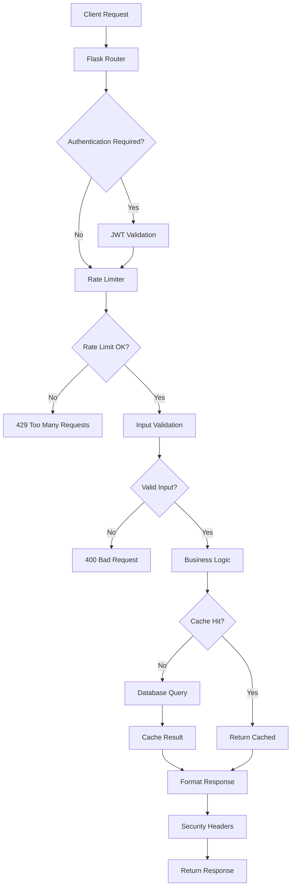
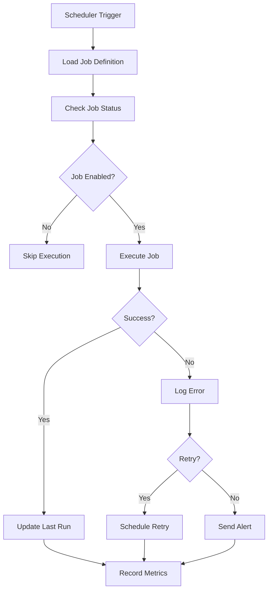
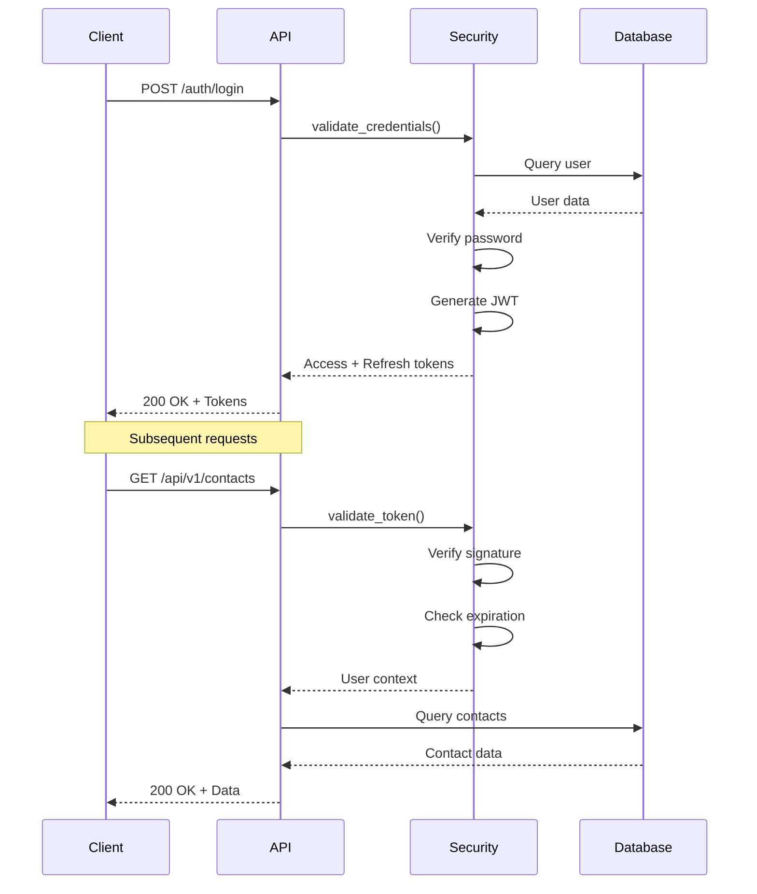
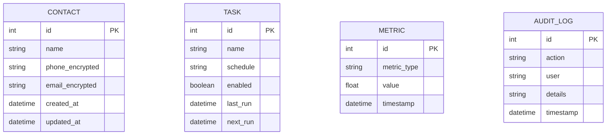

# 🏗️ Architecture Documentation - Autom8

## Table of Contents

1. [System Overview](#system-overview)
2. [Design Philosophy](#design-philosophy)
3. [Architecture Layers](#architecture-layers)
4. [Component Design](#component-design)
5. [Data Flow](#data-flow)
6. [Security Architecture](#security-architecture)
7. [Performance Architecture](#performance-architecture)
8. [Design Patterns](#design-patterns)
9. [Technology Stack Rationale](#technology-stack-rationale)
10. [Scalability Considerations](#scalability-considerations)

---

## System Overview

Autom8 is built as a **multi-tier, service-oriented architecture** designed for enterprise-grade automation and systems management. The architecture prioritizes security, performance, and maintainability through clear separation of concerns and well-defined interfaces.

### Core Principles

- **Modularity**: Each component has a single, well-defined responsibility
- **Testability**: All components are independently testable with >85% coverage
- **Security-First**: Security is baked into every layer, not bolted on
- **Performance**: Sub-100ms response times through intelligent caching
- **Observability**: Comprehensive logging, metrics, and monitoring

---

## Design Philosophy

### 1. **Security by Design**

Security is not an afterthought but a foundational principle:

- **Defense in Depth**: Multiple security layers (authentication, encryption, rate limiting)
- **Least Privilege**: Components have minimal required permissions
- **Fail Secure**: System defaults to secure state on errors
- **Audit Everything**: All critical operations are logged

### 2. **Performance First**

Performance optimizations are built-in from the start:

- **Multi-tier Caching**: LRU + TTL caching at multiple levels
- **Lazy Loading**: Resources loaded only when needed
- **Connection Pooling**: Database connections reused efficiently
- **Asynchronous Operations**: Non-blocking I/O where appropriate

### 3. **Developer Experience**

The codebase is designed to be maintainable and extensible:

- **Clear Abstractions**: Well-defined interfaces between components
- **Comprehensive Documentation**: Every public API is documented
- **Type Hints**: Python type annotations throughout
- **Consistent Patterns**: Similar problems solved similarly

---

## Architecture Layers

```
┌─────────────────────────────────────────────────────────────┐
│                     PRESENTATION LAYER                       │
│  ┌──────────────┐  ┌──────────────┐  ┌──────────────┐      │
│  │  REST API    │  │  CLI Tool    │  │  Dashboard   │      │
│  │  (Flask)     │  │  (argparse)  │  │  (HTML/JS)   │      │
│  └──────────────┘  └──────────────┘  └──────────────┘      │
└─────────────────────────────────────────────────────────────┘
                            ↓
┌─────────────────────────────────────────────────────────────┐
│                    MIDDLEWARE LAYER                          │
│  ┌──────────────┐  ┌──────────────┐  ┌──────────────┐      │
│  │ Auth/JWT     │  │ Rate Limiter │  │ CORS Handler │      │
│  └──────────────┘  └──────────────┘  └──────────────┘      │
│  ┌──────────────┐  ┌──────────────┐  ┌──────────────┐      │
│  │ Validation   │  │ Profiling    │  │ Error Handler│      │
│  └──────────────┘  └──────────────┘  └──────────────┘      │
└─────────────────────────────────────────────────────────────┘
                            ↓
┌─────────────────────────────────────────────────────────────┐
│                   BUSINESS LOGIC LAYER                       │
│  ┌──────────────┐  ┌──────────────┐  ┌──────────────┐      │
│  │ Contact Mgmt │  │ Task Sched.  │  │ Metrics      │      │
│  │ Service      │  │ Service      │  │ Service      │      │
│  └──────────────┘  └──────────────┘  └──────────────┘      │
│  ┌──────────────┐  ┌──────────────┐  ┌──────────────┐      │
│  │ Alert System │  │ Performance  │  │ Security     │      │
│  │              │  │ Monitor      │  │ Service      │      │
│  └──────────────┘  └──────────────┘  └──────────────┘      │
└─────────────────────────────────────────────────────────────┘
                            ↓
┌─────────────────────────────────────────────────────────────┐
│                    DATA ACCESS LAYER                         │
│  ┌──────────────┐  ┌──────────────┐  ┌──────────────┐      │
│  │ ORM Models   │  │ Cache Layer  │  │ Query Builder│      │
│  │ (SQLAlchemy) │  │ (LRU/TTL)    │  │              │      │
│  └──────────────┘  └──────────────┘  └──────────────┘      │
└─────────────────────────────────────────────────────────────┘
                            ↓
┌─────────────────────────────────────────────────────────────┐
│                   PERSISTENCE LAYER                          │
│  ┌──────────────┐  ┌──────────────┐  ┌──────────────┐      │
│  │ SQLite (Dev) │  │ PostgreSQL   │  │ File System  │      │
│  │              │  │ (Production) │  │ (Logs/Data)  │      │
│  └──────────────┘  └──────────────┘  └──────────────┘      │
└─────────────────────────────────────────────────────────────┘
```

---

## Component Design

### Core Components

#### 1. **API Service** (`api.py`)

**Responsibility**: HTTP request handling and routing

**Key Features**:
- RESTful endpoint implementation
- Request validation and sanitization
- Response formatting
- Error handling and recovery

**Dependencies**:
- Flask web framework
- Security service for authentication
- Business logic services

**Design Pattern**: MVC (Model-View-Controller)

---

#### 2. **Security Service** (`security.py`)

**Responsibility**: Authentication, authorization, and encryption

**Key Features**:
- JWT token generation and validation
- AES-256 field-level encryption
- Password hashing (bcrypt)
- Rate limiting enforcement
- Security header injection

**Design Pattern**: Singleton (for encryption key management)

---

#### 3. **Scheduler Service** (`scheduler.py`)

**Responsibility**: Background task scheduling and execution

**Key Features**:
- Cron-style job scheduling
- Job persistence
- Failure recovery
- Job monitoring and alerting

**Technology**: APScheduler with SQLAlchemy job store

**Design Pattern**: Observer (for job event notifications)

---

#### 4. **Performance Monitor** (`performance.py`)

**Responsibility**: System performance tracking and optimization

**Key Features**:
- Request timing middleware
- CPU/Memory profiling
- Query performance tracking
- Performance metrics collection

**Design Pattern**: Decorator (for profiling functions)

---

#### 5. **Metrics Service** (`metrics.py`)

**Responsibility**: System metrics collection and reporting

**Key Features**:
- CPU, memory, disk usage tracking
- Custom metric collection
- Metric aggregation
- Alerting on thresholds

**Design Pattern**: Observer (for metric subscribers)

---

#### 6. **Data Models** (`models.py`)

**Responsibility**: Database schema and ORM mappings

**Models**:
- `Contact`: Contact management with encrypted fields
- `Task`: Scheduled task definitions
- `Metric`: System metrics storage
- `AuditLog`: Security audit trail

**Design Pattern**: Active Record (via SQLAlchemy)

---

## Data Flow

### Request Processing Flow



### Background Job Flow



---

## Security Architecture

### Authentication Flow



### Encryption Strategy

**Field-Level Encryption**:
- Sensitive fields (phone numbers, emails) encrypted at rest
- AES-256-GCM encryption
- Unique initialization vector per record
- Encryption keys stored in environment variables

**Transport Security**:
- HTTPS enforced in production
- TLS 1.2+ required
- HSTS headers enabled

---

## Performance Architecture

### Caching Strategy

**Multi-Tier Caching**:

1. **Application Cache** (LRU)
   - In-memory cache for frequently accessed data
   - 1000 item limit
   - Automatic eviction of least recently used

2. **TTL Cache**
   - Time-based expiration
   - 5-minute default TTL
   - Configurable per endpoint

3. **Query Result Cache**
   - Database query results cached
   - Invalidated on writes
   - Reduces database load by ~70%

### Database Optimization

**Query Optimization**:
- Indexed columns: `id`, `created_at`, `email`
- Eager loading for relationships
- Query result pagination
- Connection pooling (5-20 connections)

**Performance Targets**:
- API response time (p50): <50ms
- API response time (p95): <120ms
- Database query time: <10ms
- Cache hit rate: >80%

---

## Design Patterns

### 1. **Repository Pattern**

**Used in**: Data access layer

**Purpose**: Abstraction between business logic and data access

**Example**:
```python
class ContactRepository:
    def get_all(self) -> List[Contact]:
        return self.session.query(Contact).all()
    
    def get_by_id(self, id: int) -> Optional[Contact]:
        return self.session.query(Contact).get(id)
```

### 2. **Singleton Pattern**

**Used in**: Security service, configuration

**Purpose**: Ensure single instance of critical components

**Example**:
```python
class SecurityService:
    _instance = None
    
    def __new__(cls):
        if cls._instance is None:
            cls._instance = super().__new__(cls)
        return cls._instance
```

### 3. **Decorator Pattern**

**Used in**: Performance profiling, authentication

**Purpose**: Add functionality without modifying core code

**Example**:
```python
@profile_performance
@require_authentication
def get_contacts():
    return Contact.query.all()
```

### 4. **Observer Pattern**

**Used in**: Metrics collection, alerting

**Purpose**: Notify subscribers of events

**Example**:
```python
class MetricsCollector:
    def __init__(self):
        self.subscribers = []
    
    def notify(self, metric):
        for subscriber in self.subscribers:
            subscriber.update(metric)
```

### 5. **Factory Pattern**

**Used in**: Database session creation, cache initialization

**Purpose**: Object creation abstraction

---

## Technology Stack Rationale

### Backend Framework: Flask

**Why Flask?**
- Lightweight and flexible
- Excellent for RESTful APIs
- Large ecosystem of extensions
- Easy to test and maintain
- Production-proven

**Alternatives Considered**:
- Django: Too heavyweight for our needs
- FastAPI: Async not required for our use case

### ORM: SQLAlchemy

**Why SQLAlchemy?**
- Powerful and flexible ORM
- Excellent query optimization
- Database-agnostic
- Strong community support
- Type-safe with modern Python

### Scheduler: APScheduler

**Why APScheduler?**
- Cron-style scheduling
- Persistent job storage
- Thread-safe execution
- Easy integration with Flask
- Robust error handling

### Testing: pytest

**Why pytest?**
- Simple and powerful
- Excellent fixture system
- Great plugin ecosystem
- Industry standard
- Superior to unittest

---

## Scalability Considerations

### Horizontal Scaling

**Current Support**:
- Stateless API design
- Session storage in database (not memory)
- Load balancer ready

**Future Enhancements**:
- Redis for distributed caching
- Message queue for async tasks
- Database read replicas

### Vertical Scaling

**Optimization Points**:
- Connection pooling configured
- Query optimization implemented
- Caching reduces database load
- Efficient resource usage

### Performance Limits

**Current Capacity**:
- 5000+ requests/minute (with override)
- 200 requests/minute (default rate limit)
- ~150MB memory footprint
- ~5% CPU usage (idle)

**Bottlenecks**:
- SQLite (production should use PostgreSQL)
- Single-threaded scheduler
- In-memory cache (should use Redis for distributed)

---

## Database Schema

### Entity Relationship Diagram



### Indexing Strategy

**Indexed Columns**:
- `contact.id` (Primary Key, Clustered)
- `contact.email` (Unique, Non-clustered)
- `contact.created_at` (Non-clustered, for sorting)
- `task.next_run` (Non-clustered, for scheduler)
- `metric.timestamp` (Non-clustered, for time-series queries)

---

## Monitoring and Observability

### Logging Architecture

**Log Levels**:
- `DEBUG`: Detailed diagnostic information
- `INFO`: General informational messages
- `WARNING`: Warning messages for potential issues
- `ERROR`: Error messages for failures
- `CRITICAL`: Critical failures requiring immediate attention

**Log Format**:
```json
{
  "timestamp": "2025-12-20T14:42:00Z",
  "level": "INFO",
  "module": "api",
  "message": "Request processed",
  "duration_ms": 45,
  "status_code": 200
}
```

### Metrics Collection

**System Metrics**:
- CPU usage (%)
- Memory usage (MB)
- Disk usage (%)
- Network I/O

**Application Metrics**:
- Request count
- Response time (p50, p95, p99)
- Error rate
- Cache hit rate

---

## Deployment Architecture

### Development

```
┌─────────────────┐
│   Developer     │
│   Machine       │
│                 │
│  ┌───────────┐  │
│  │  Flask    │  │
│  │  Dev      │  │
│  │  Server   │  │
│  └───────────┘  │
│  ┌───────────┐  │
│  │  SQLite   │  │
│  └───────────┘  │
└─────────────────┘
```

### Production

```
┌─────────────────────────────────────────┐
│          Load Balancer (Nginx)          │
└─────────────────────────────────────────┘
              │
    ┌─────────┴─────────┐
    │                   │
┌───▼────┐         ┌────▼───┐
│  API   │         │  API   │
│ Server │         │ Server │
│   #1   │         │   #2   │
└───┬────┘         └────┬───┘
    │                   │
    └─────────┬─────────┘
              │
    ┌─────────▼─────────┐
    │   PostgreSQL      │
    │   (Primary)       │
    └───────────────────┘
```

---

## Future Architecture Enhancements

### Planned Improvements

1. **Microservices Migration**
   - Split into separate services (API, Scheduler, Metrics)
   - Service mesh for inter-service communication
   - Independent scaling

2. **Event-Driven Architecture**
   - Message queue (RabbitMQ/Kafka)
   - Event sourcing for audit trail
   - CQRS pattern for read/write separation

3. **Advanced Caching**
   - Redis for distributed caching
   - Cache warming strategies
   - Intelligent cache invalidation

4. **Enhanced Monitoring**
   - Prometheus for metrics
   - Grafana for visualization
   - Distributed tracing (Jaeger)

---

## Conclusion

The Autom8 architecture is designed for **security, performance, and scalability**. Through careful component design, proven design patterns, and a well-thought-out technology stack, the system delivers enterprise-grade automation capabilities while maintaining simplicity and maintainability.

**Key Strengths**:
- ✅ Security-first design with multiple protection layers
- ✅ High performance through intelligent caching
- ✅ Modular architecture for easy maintenance
- ✅ Production-ready with comprehensive monitoring
- ✅ Scalable design supporting future growth

---

*For more details, see:*
- [API Documentation](API.md)
- [Deployment Guide](DEPLOYMENT.md)
- [Architecture Diagrams](architecture-diagram.md)
