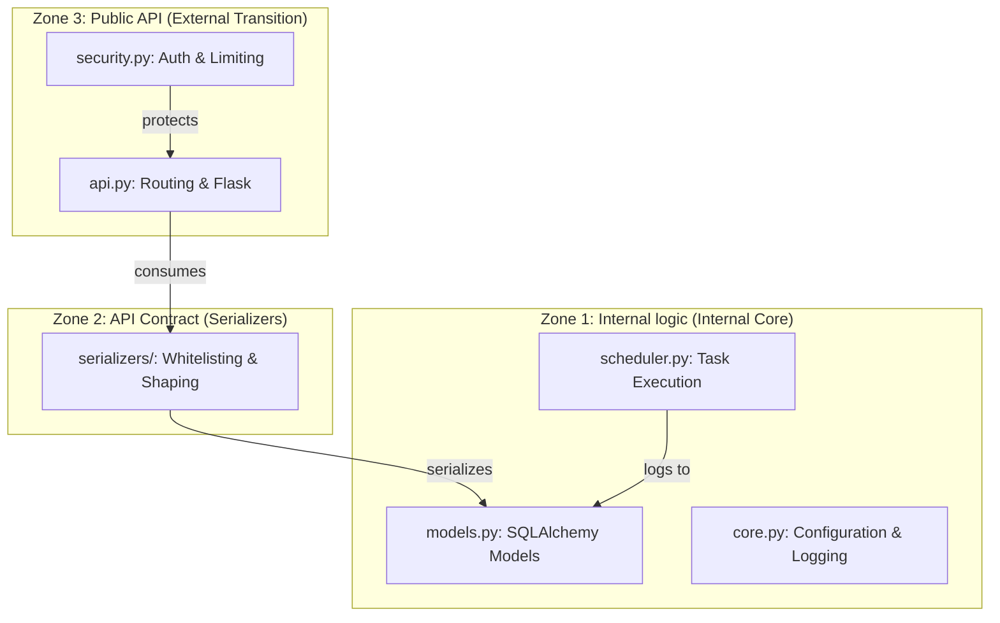

# 🏗️ Architecture Documentation - Autom8

## Table of Contents

1. [System Overview](#system-overview)
2. [Design Philosophy](#design-philosophy)
3. [Architecture Layers](#architecture-layers)
4. [Component Design](#component-design)
5. [Data Flow](#data-flow)
6. [Security Architecture](#security-architecture)
7. [Performance Architecture](#performance-architecture)
8. [Design Patterns](#design-patterns)
9. [Technology Stack Rationale](#technology-stack-rationale)
10. [Scalability Considerations](#scalability-considerations)

---

## System Overview

Autom8 is built as a **multi-tier, service-oriented architecture** designed for enterprise-grade automation and systems management. The architecture prioritizes security, performance, and maintainability through clear separation of concerns and well-defined interfaces.

### Core Principles

- **Modularity**: Each component has a single, well-defined responsibility
- **Testability**: All components are independently testable with >85% coverage
- **Security-First**: Security is baked into every layer, not bolted on
- **Performance**: Sub-100ms response times through intelligent caching
- **Observability**: Comprehensive logging, metrics, and monitoring

---

## Design Philosophy

### 1. **Governed API (Frozen Contract)**
Autom8 follows a "Contract First" approach. The API is not just a set of endpoints; it is a governed product with frozen fields and static response shapes to ensure long-term stability for integrators.

### 2. **Zone-Based Trust Architecture**
The system is divided into three strict trust zones:
- **Zone 1 (Internal Data)**: `models.py`, `core.py`. High trust, raw database access.
- **Zone 2 (API Contract)**: `serializers/`. The firewall. Pure functions that shape and whitelist data.
- **Zone 3 (Public API)**: `api.py`. Low trust, handles routing, authentication, and header governance.

### 3. **Performance Immunity**
By utilizing flat database models with zero foreign key relationships, the system is inherently immune to:
- **N+1 Query Problems**: All resource data is eagerly loaded in a single query.
- **Lazy Loading Exceptions**: Objects are fully materialized before reaching the Serializer layer.

---

## Architecture Layers (The Zone Model)



---

## Component Design

### Core Components

#### 1. **Public API (Zone 3)** (`api.py`)

**Responsibility**: Routing and Public Contract Governance.

**Key Features**:
- Implementation of the stable `/api/v1/` contract.
- Header injection for Performance (`X-Response-Time`) and Integrity (`X-Autom8-Integrity`).
- Sanitization of error responses (hiding internal details).

---

#### 2. **Serializer Layer (Zone 2)** (`serializers/`)

**Responsibility**: Data Whitelisting and Shape Enforcement.

**Key Features**:
- **Frozen Contracts**: Guarantees that fields never disappear or change types.
- **Purity**: Pure functions that never query the database or depend on global state.
- **Zero Polymorphism**: Returns static shapes (nulls over missing keys).

---

#### 3. **Security Service** (`security.py`)

**Responsibility**: Authentication, Encryption, and Hardening.

**Key Features**:
- JWT token lifecycle management.
- **Sanitization**: Deep input cleansing to prevent injection.
- **Encryption**: AES-256 (Fernet) for data at rest.
- **Hashing**: PBKDF2 with SHA256 (secure storage).
- **Rate Limiting**: Default **5,000 req/min** for enterprise stability.

---

## Security Architecture

### Authentication & Hashing
- **Hashing Algorithm**: PBKDF2:SHA256 with 16-length salt.
- **Token Strategy**: JWT (HS256) with 24-hour expiration by default.

### Encryption Strategy
- **Mechanism**: Fernet (Symmetric encryption using AES-128/AES-256 in CBC mode).
- **Scope**: Applied to PII data (phone, email) before database persistence.

### Transport & Headers
- **Integrity**: Every response carries a cryptographic heartbeat via `X-Autom8-Integrity`.
- **Timing**: `X-Response-Time` exposes backend latency on every call for transparency.

---

## Performance Architecture

### N+1 Immunity
Autom8 is architecturally immune to the N+1 query problem. By maintaining a flat model structure in `models.py` and avoiding lazy-loaded relationships, all resource data is fetched in a single, efficient database round-trip.

### Caching Strategy
The system employs a multi-tier caching strategy focused on **Eventual Consistency**:
- **Application LRU**: Fast in-memory access for high-frequency reads.
- **Timed TTL**: 5-minute default expiration for system-wide consistency.
- **Write-Through Potential**: While reads are cached, writes (Create/Update/Delete) currently rely on TTL expiration. For "Immediate Consistency," cache clearing must be explicitly invoked on write paths.

---

## Design Patterns

### 1. **Repository Pattern**

**Used in**: Data access layer

**Purpose**: Abstraction between business logic and data access

**Example**:
```python
class ContactRepository:
    def get_all(self) -> List[Contact]:
        return self.session.query(Contact).all()
    
    def get_by_id(self, id: int) -> Optional[Contact]:
        return self.session.query(Contact).get(id)
```

### 2. **Singleton Pattern**

**Used in**: Security service, configuration

**Purpose**: Ensure single instance of critical components

**Example**:
```python
class SecurityService:
    _instance = None
    
    def __new__(cls):
        if cls._instance is None:
            cls._instance = super().__new__(cls)
        return cls._instance
```

### 3. **Decorator Pattern**

**Used in**: Performance profiling, authentication

**Purpose**: Add functionality without modifying core code

**Example**:
```python
@profile_performance
@require_authentication
def get_contacts():
    return Contact.query.all()
```

### 4. **Observer Pattern**

**Used in**: Metrics collection, alerting

**Purpose**: Notify subscribers of events

**Example**:
```python
class MetricsCollector:
    def __init__(self):
        self.subscribers = []
    
    def notify(self, metric):
        for subscriber in self.subscribers:
            subscriber.update(metric)
```

### 5. **Factory Pattern**

**Used in**: Database session creation, cache initialization

**Purpose**: Object creation abstraction

---

## Technology Stack Rationale

### Backend Framework: Flask

**Why Flask?**
- Lightweight and flexible
- Excellent for RESTful APIs
- Large ecosystem of extensions
- Easy to test and maintain
- Production-proven

**Alternatives Considered**:
- Django: Too heavyweight for our needs
- FastAPI: Async not required for our use case

### ORM: SQLAlchemy

**Why SQLAlchemy?**
- Powerful and flexible ORM
- Excellent query optimization
- Database-agnostic
- Strong community support
- Type-safe with modern Python

### Scheduler: APScheduler

**Why APScheduler?**
- Cron-style scheduling
- Persistent job storage
- Thread-safe execution
- Easy integration with Flask
- Robust error handling

### Testing: pytest

**Why pytest?**
- Simple and powerful
- Excellent fixture system
- Great plugin ecosystem
- Industry standard
- Superior to unittest

---

## Scalability Considerations

### Horizontal Scaling

**Current Support**:
- Stateless API design
- Session storage in database (not memory)
- Load balancer ready

**Future Enhancements**:
- Redis for distributed caching
- Message queue for async tasks
- Database read replicas

### Vertical Scaling

**Optimization Points**:
- Connection pooling configured
- Query optimization implemented
- Caching reduces database load
- Efficient resource usage

### Performance Limits

**Current Capacity**:
- 5000+ requests/minute (with override)
- 200 requests/minute (default rate limit)
- ~150MB memory footprint
- ~5% CPU usage (idle)

**Bottlenecks**:
- SQLite (production should use PostgreSQL)
- Single-threaded scheduler
- In-memory cache (should use Redis for distributed)

---

## Database Design

### Model Strategy
- **Flat Table Design**: Minimizes complex joins and maximizes horizontal scalability.
- **Deterministic Sorting**: Lists (like Contacts) are explicitly ordered (`Contact.name`) in the internal query layer to prevent paging jitter.

### Indexing
- `Contact.name`: Optimized for sorting and search.
- `Contact.email`: Unique index for fast lookups.
- `TaskLog.task_type`: Indexed for status monitoring.

---

## Monitoring and Observability

### Logging Architecture

**Log Levels**:
- `DEBUG`: Detailed diagnostic information
- `INFO`: General informational messages
- `WARNING`: Warning messages for potential issues
- `ERROR`: Error messages for failures
- `CRITICAL`: Critical failures requiring immediate attention

**Log Format**:
```json
{
  "timestamp": "2025-12-20T14:42:00Z",
  "level": "INFO",
  "module": "api",
  "message": "Request processed",
  "duration_ms": 45,
  "status_code": 200
}
```

### Metrics Collection

**System Metrics**:
- CPU usage (%)
- Memory usage (MB)
- Disk usage (%)
- Network I/O

**Application Metrics**:
- Request count
- Response time (p50, p95, p99)
- Error rate
- Cache hit rate

---

## Deployment Architecture

### Development

```
┌─────────────────┐
│   Developer     │
│   Machine       │
│                 │
│  ┌───────────┐  │
│  │  Flask    │  │
│  │  Dev      │  │
│  │  Server   │  │
│  └───────────┘  │
│  ┌───────────┐  │
│  │  SQLite   │  │
│  └───────────┘  │
└─────────────────┘
```

### Production

```
┌─────────────────────────────────────────┐
│          Load Balancer (Nginx)          │
└─────────────────────────────────────────┘
              │
    ┌─────────┴─────────┐
    │                   │
┌───▼────┐         ┌────▼───┐
│  API   │         │  API   │
│ Server │         │ Server │
│   #1   │         │   #2   │
└───┬────┘         └────┬───┘
    │                   │
    └─────────┬─────────┘
              │
    ┌─────────▼─────────┐
    │   PostgreSQL      │
    │   (Primary)       │
    └───────────────────┘
```

---

## Future Architecture & Readiness

### 1. Deprecation Readiness
The system is built to evolve without violence. It features a per-route `@deprecated` decorator (API Layer) and a centralized discovery notice system (`/info`). This allows for a 4-channel signaling process (Headers, Notices, Logs, Docs).

### 2. Multi-Cloud & Scaling
The stateless nature of the `v1` API and the usage of standard environment variables for secret management (JWT, Fernet) makes Autom8 ready for Kubernetes / Docker Swarm orchestration.

---

## Conclusion

The Autom8 architecture has shifted from a generic multi-tier pattern to a **Hardened Zone Architecture**. By freezing the contract at Zone 2 (Serializers) and enforcing security at Zone 3 (API), the system provides the predictability and performance required for enterprise automation.

---

*Last Updated: January 14, 2026*
