# 📐 Architecture Diagrams - Autom8

Visual representation of the Autom8 system architecture.

## System Architecture Overview

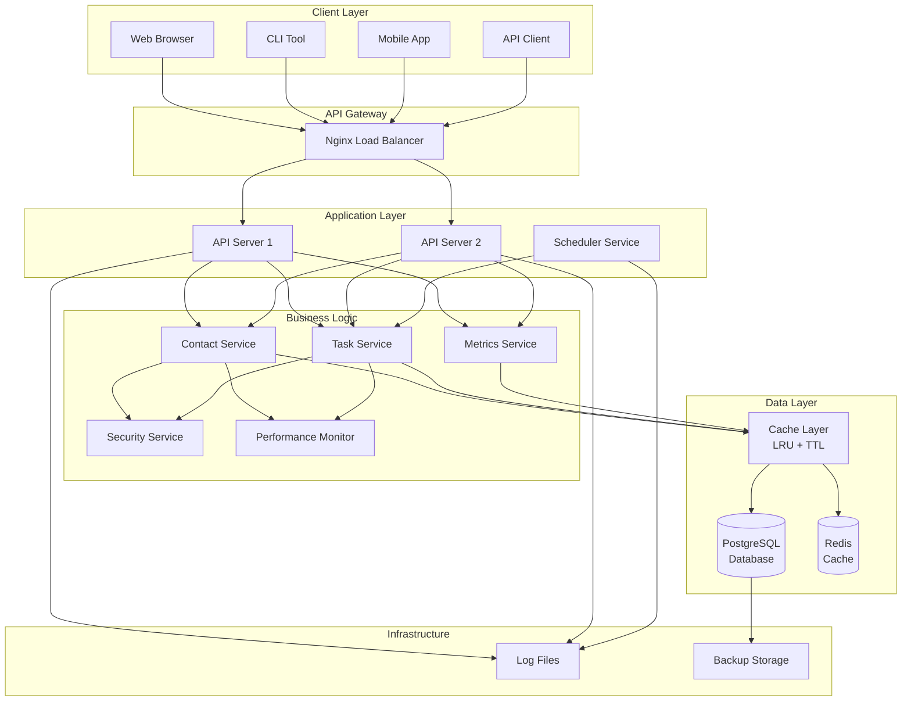

## Request Flow Diagram

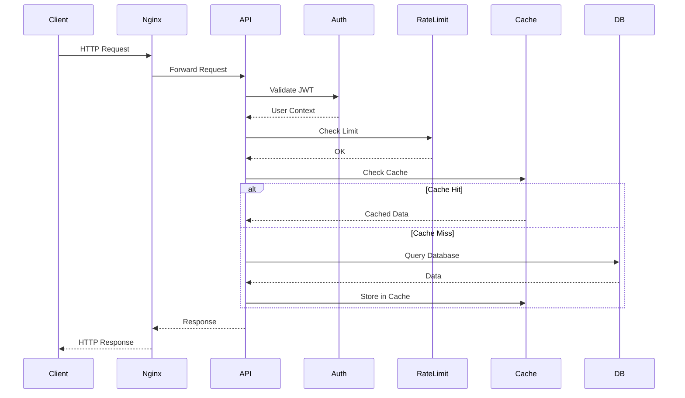

## Component Interaction Diagram

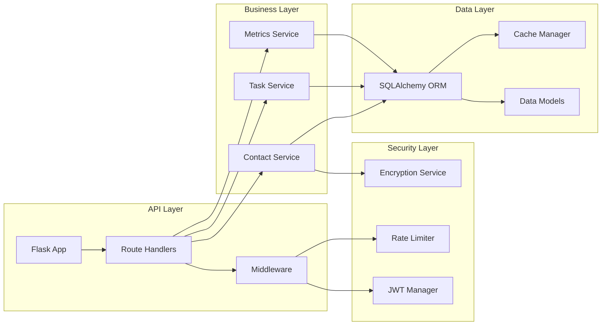

## Data Flow Diagram

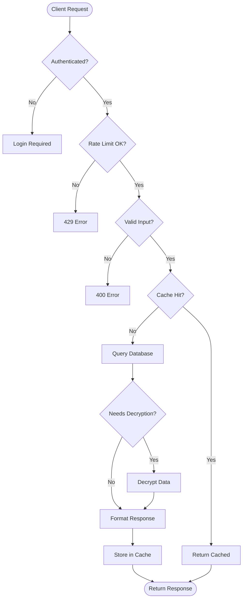

## Security Architecture

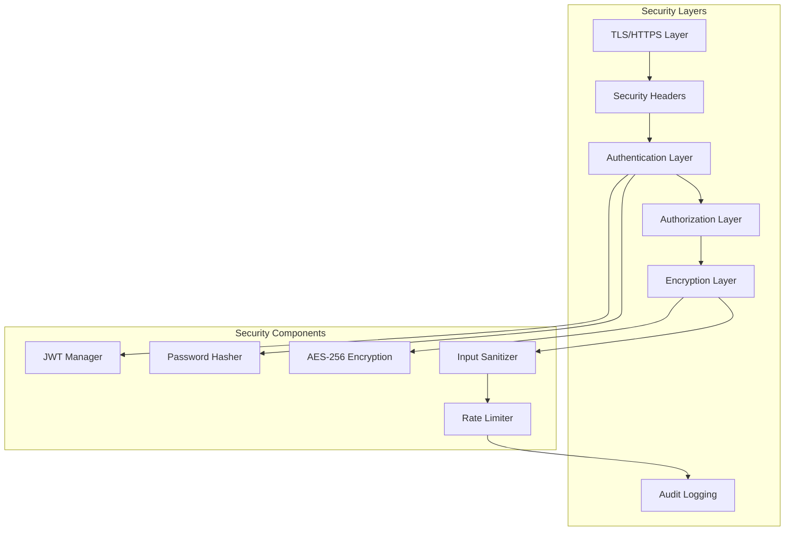

## Deployment Architecture

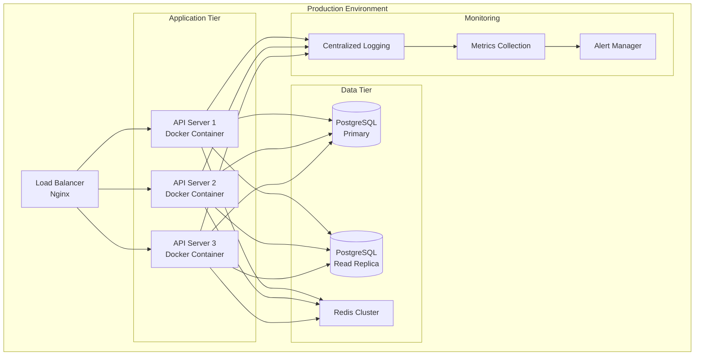

## Database Schema Diagram

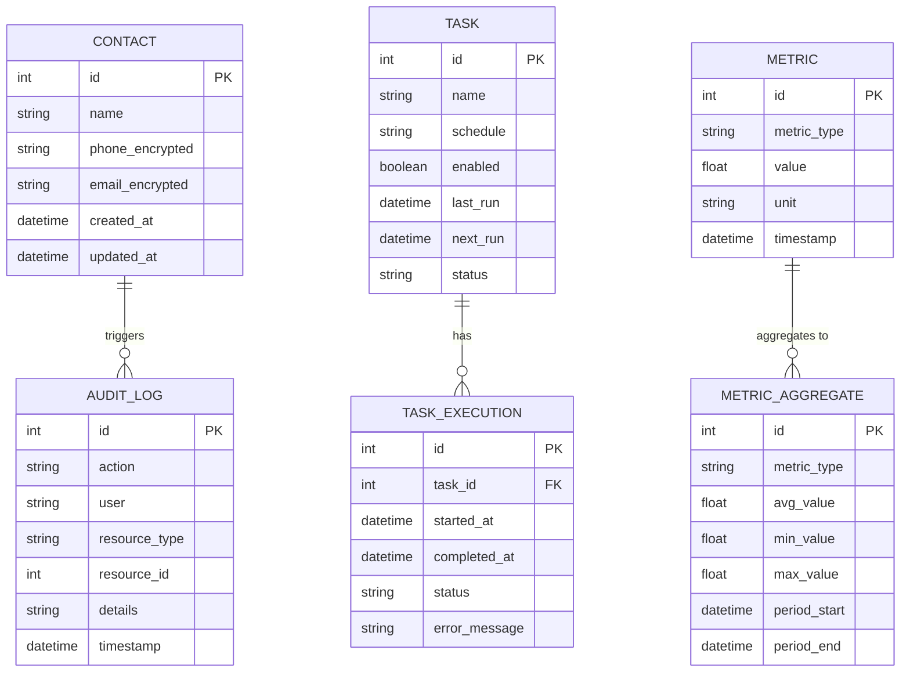

## Caching Strategy Diagram

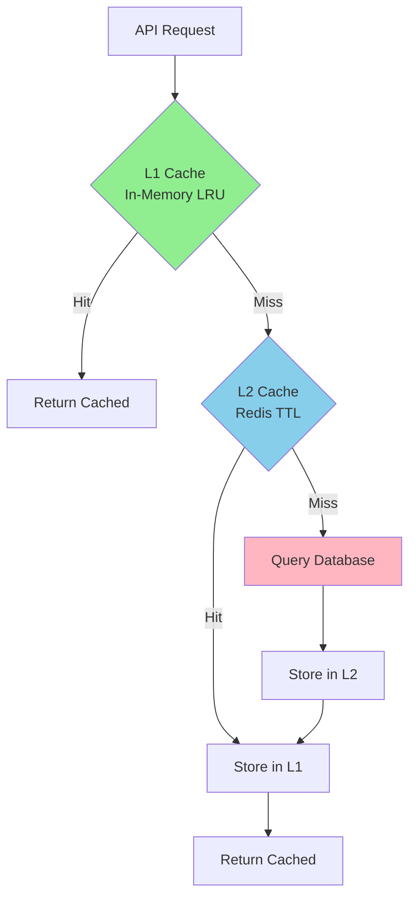

## Scheduler Architecture

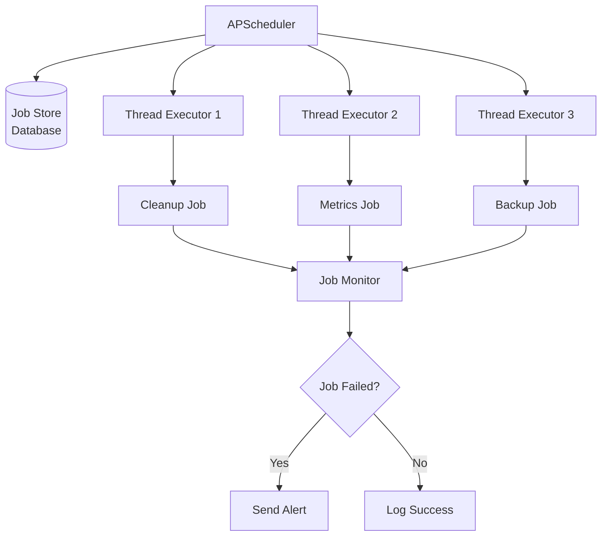

## Monitoring Architecture

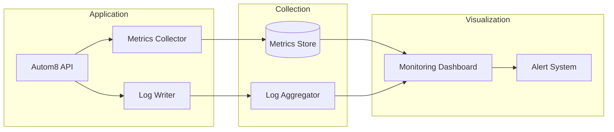

## Network Topology

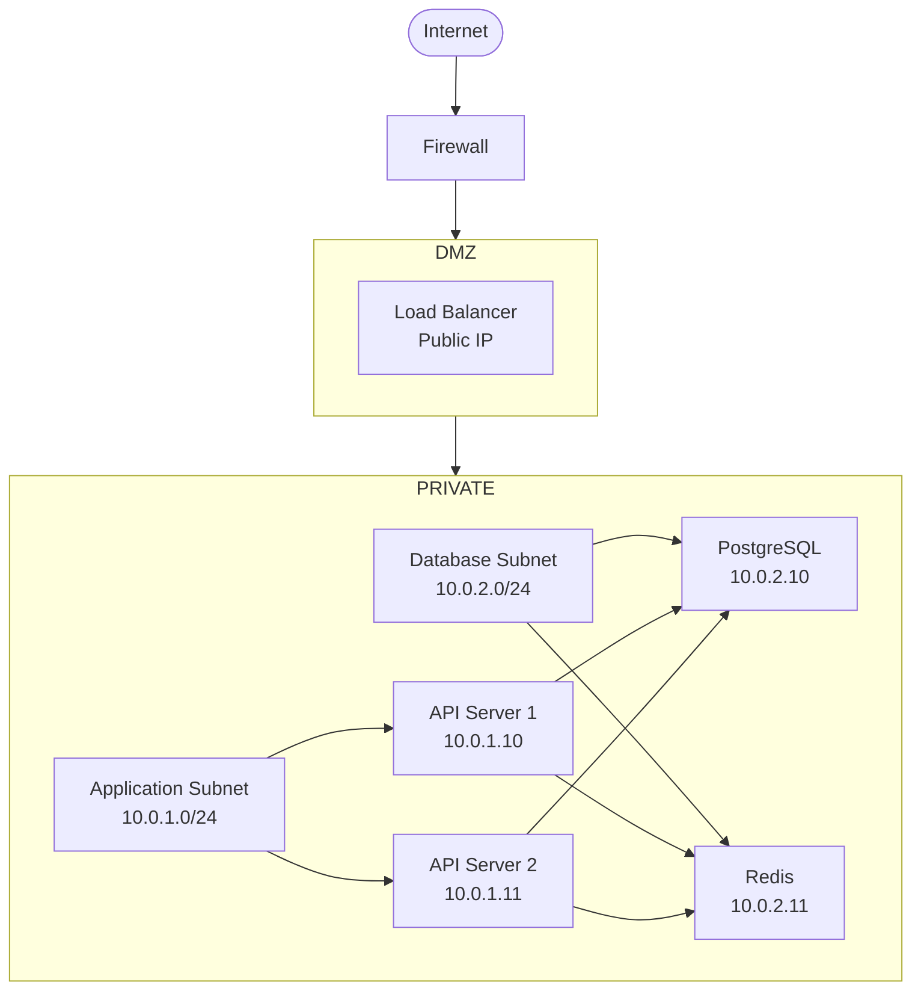

## CI/CD Pipeline Flow

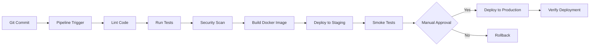

---

## Legend

### Colors
- 🟢 Green: Cache/Fast operations
- 🔵 Blue: Services/Components
- 🔴 Red: Database/Persistent storage
- 🟡 Yellow: Security components
- 🟣 Purple: Monitoring/Logging

### Symbols
- `[]` Rectangle: Process/Service
- `()` Rounded: Start/End points
- `{}` Diamond: Decision points
- `[(Database)]` Cylinder: Data storage

---

*For detailed architecture documentation, see [ARCHITECTURE.md](ARCHITECTURE.md)*
